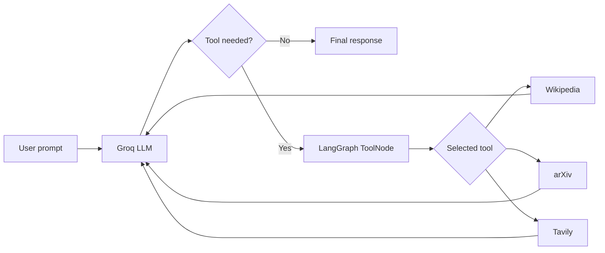

# LangGraph Multi-Tool Chatbot

A notebook-based AI assistant built with LangGraph and LangChain. It uses a
Groq-hosted language model to decide when to search Wikipedia, query arXiv, or
look up current information with Tavily, then combines the tool results into a
natural-language response.

## What it demonstrates

- Tool calling with `ChatGroq` and Llama 3.3 70B
- A typed LangGraph conversation state with message reducers
- Conditional routing between an LLM node and external tools
- Multi-step tool use for questions that need more than one source
- Wikipedia, arXiv, and live web-search integrations
- Environment-based API key management with `python-dotenv`

## Workflow



## Project structure

```text
.
├── chatbotmultipletools.ipynb  # End-to-end chatbot walkthrough
├── requirements.txt            # Python dependencies
├── .env.example                # Required environment-variable template
└── README.md
```

## Getting started

### 1. Clone the repository

```bash
git clone https://github.com/abhinav-bagwari/chatbot-langgraph.git
cd chatbot-langgraph
```

### 2. Create and activate a virtual environment

Python 3.10 or newer is recommended.

```bash
python3 -m venv .venv
source .venv/bin/activate
```

On Windows PowerShell:

```powershell
python -m venv .venv
.venv\Scripts\Activate.ps1
```

### 3. Install the dependencies

```bash
python -m pip install --upgrade pip
python -m pip install -r requirements.txt
python -m pip install notebook
```

### 4. Configure API keys

Copy the example configuration and replace the placeholder values with your own
Groq and Tavily API keys:

```bash
cp .env.example .env
```

```dotenv
GROQ_API_KEY=your_groq_api_key_here
TAVILY_API_KEY=your_tavily_api_key_here
```

The `.env` file is intentionally ignored by Git. Never commit real credentials.

### 5. Run the notebook

```bash
jupyter notebook chatbotmultipletools.ipynb
```

Run the cells from top to bottom. The notebook first exercises each tool
individually, then builds LangGraph workflows that route requests through the
model and the appropriate tools.

## Example prompts

```text
Search arXiv for paper 1706.03762.
```

```text
What is the latest AI news?
```

```text
Find recent AI news, then show me a recent research paper on quantum computing.
```

## How it works

1. The notebook creates Wikipedia, arXiv, and Tavily tools.
2. Those tools are bound to the Groq chat model.
3. LangGraph stores the conversation in a typed `messages` state.
4. `tools_condition` checks whether the model requested a tool.
5. `ToolNode` executes the request and sends the result back to the model.
6. The graph returns a final answer when no additional tool call is needed.

## Notes

- Tavily and Groq usage is subject to the limits of your respective accounts.
- Wikipedia and arXiv queries require an internet connection.
- Search results and model responses can change between notebook runs.

## Contributing

Issues and pull requests are welcome. If you add a new integration, update both
the dependency list and this README, and keep credentials in environment
variables rather than source files or notebook outputs.
